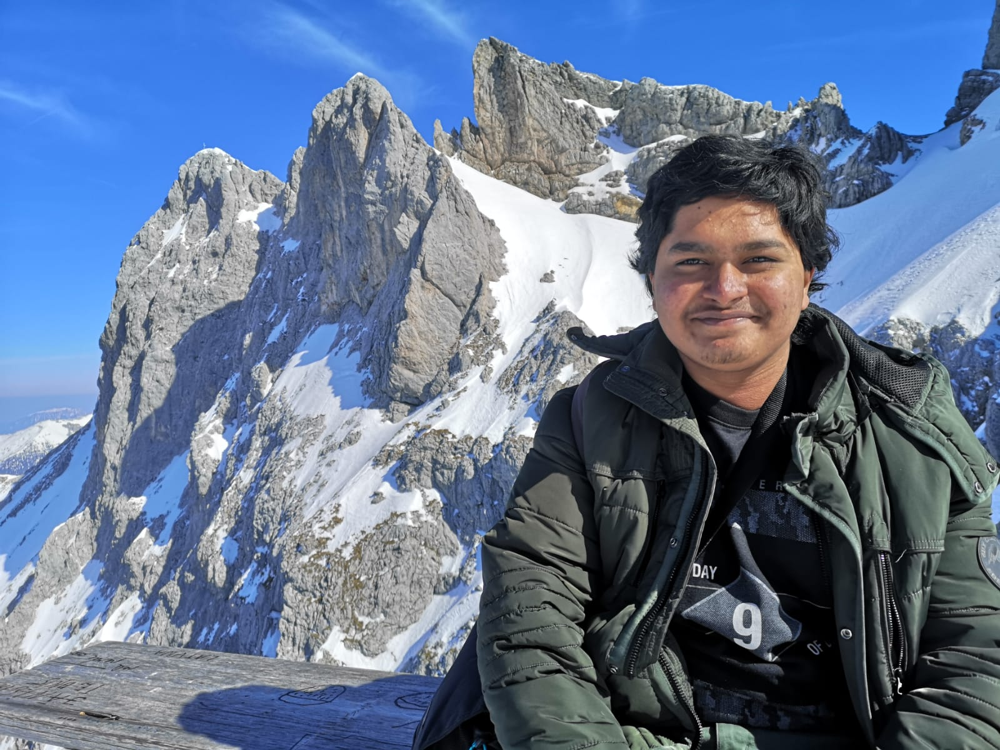

# **Sathvick Bindinganavale Srinath**
<base target="_blank">
## <ins>About Me</ins>
{: style="width:400px" }

Hello there ☺️.   
I'm a recent graduate in Mechatronics from the Technical University of Applied Sciences Würzburg-Schweinfurt. I have a strong interest in Machine Learning, Automation, Data Science and Software Development and am currently looking for opportunities in the above mentioned fields. I am a quick learner and a team player with excellent communication skills. I am passionate about learning new technologies and applying them to solve real-world problems. I am a self-motivated individual with a strong work ethic and a positive attitude. I am looking forward to working on challenging projects and contributing to the success of 
the organization.

---

## <ins>Experience</ins>
### **Bachelor Thesis Student**
Robert Bosch GmbH, Schwieberdingen, Germany  
*April 2024 - October 2024*

<ins>Title</ins>: **Development of a Continuous Integration Framework for Optimization Workflows** 
*[Link to Thesis Repository](https://github.com/Sathvick11/Bachelor-Thesis/blob/main/Thesis_Latex/main.pdf) (Grade:1,3)*

- Initially, developed a workaround of executing parametric simualtions without the use of GUI.
- Tested the automated execution for parametric simulations for MATLAB and Python modules.
- Implemented a Framework in Python for automated creation of parametric actors in optiSLang using Python.
- Integrated the Framework with GitHub Actions for Continuous Integration. This enabled to provide the developers with their latest changes immediately after the commit.
- The input files are stored in a docker container in OpenShift. These files are later used by the framework, when required, via FastAPI.
- By implementing the framework, the developers were able to save time on integration testing of modules from 20-30 minutes to 10-20 seconds.

### **DevOps Intern**
Robert Bosch GmbH, Schwieberdingen, Germany 
*August 2024 - February 2024*

- Developed a data visual dashboard using Python to provide insights into the open issues and tasks in Jira and Confluence. This provided data driven insights into the project performance and records.
- Created and maintained CI/CD pipelines in Windows and Linux environments using GitHub Actions. This ensured smooth integration of the code and automated test processes.
- Implemented automated testing in simulations such as ANSYS, PSpice and MATLAB using Python and Batch scripting.
- Management of user accounts and permissions in cloud-hosted tools, ensuring secure and efficient access for team members.

### **Student Assistant**
THWS, Schweinfurt, Germany 
October 2022 - March 2023

- Worked as a Python Developer for a research project - [KoPro](https://www.thws.de/forschung/institute/idee/abgeschlossene-idee-projekte/kopro/), which mainly focuses on the development of interaction between robots and humans in the workplace.
- The goal of the project was to build a simple DUPLO brick model using a Kuka robot. For the robot to grip the bricks, it needs to know the dimensions of the bricks.  
- Developed an algorithm in Python to extract the data of the DUPLO blocks such as length, width, and height and physical properties such as inertia, mass and center of gravity from CAD files.
- The extracted data was later stored in MongoDB and used by the robot to grip the bricks. 

---

## <ins>Education</ins>
### **Mechatronics (B.Eng)**
[Technical University of Applied Sciences Würzburg-Schweinfurt](https://www.thws.de/en), Schweinfurt, Germany  
October 2020 - February 2025

Main Courses:

- Applied Machine Learning and Design of Experiments
- Object Oriented Programming and Software Engineering
- Cryptogrpahy and Ethical Hacking
- Hardware Description Languages and Embedded Systems
- Control Systems

---

## <ins>Skills</ins>
- Programming Languages:  
    Python, C++, Batch Scripting, YAML, SystemVerilog, HTML, CSS, MATLAB, LaTeX
- Tools:  
Git, Docker, JIRA, Confluence, VSCode, OpenShift, REST API, CI/CD
- Simulation Tools:  
Ansys optiSLang, Simulink, PSpice, Fusion360, PTC Creo

---
## <ins>Contact</ins>
You can also find me on

   